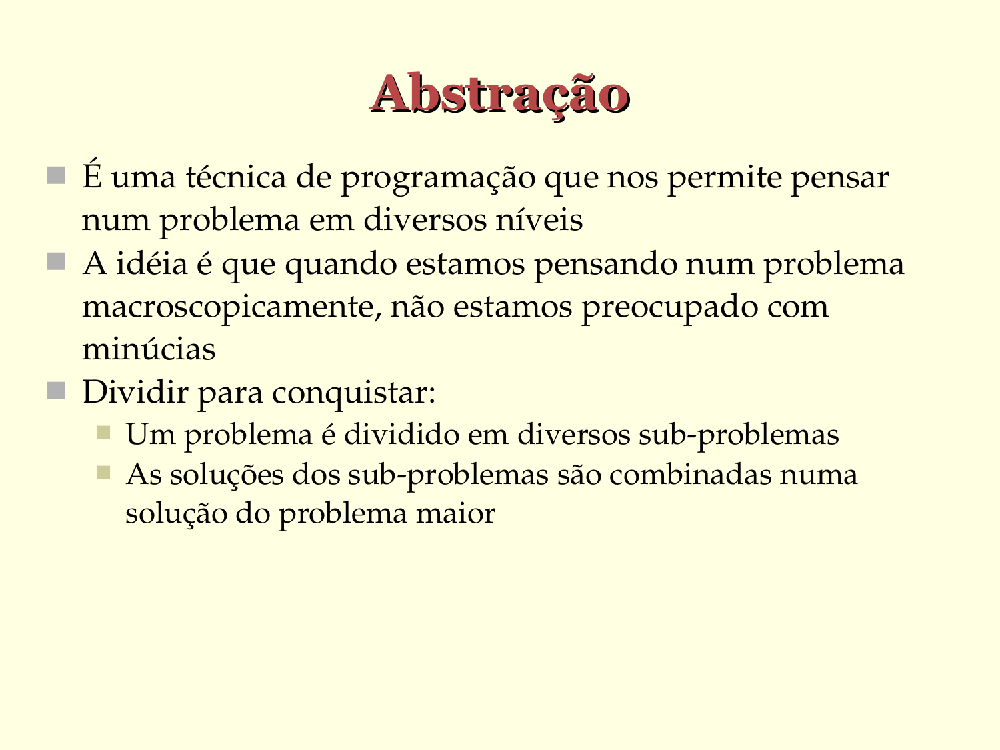

# Abstração

- É uma técnica de programação que nos permite pensar
  num problema em diversos níveis
- A idéia é que quando estamos pensando num problema
  macroscopicamente, não estamos preocupado com
  minúcias
- Dividir para conquistar:
   - Um problema é dividido em diversos sub­problemas
   - As soluções dos sub­problemas são combinadas numa
     solução do problema maior

