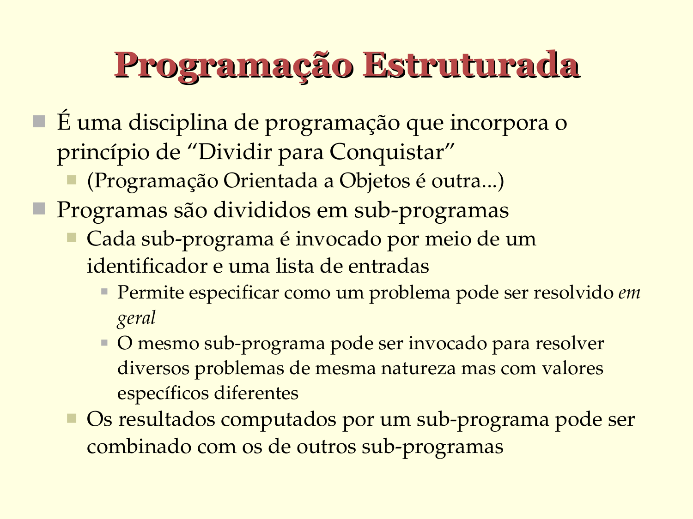

# Programação Estruturada

- É uma disciplina de programação que incorpora o
  princípio de "Dividir para Conquistar"
   - (Programação Orientada a Objetos é outra...)

- Programas são divididos em sub­programas
   - Cada sub­programa é invocado por meio de um
     identificador e uma lista de entradas
      - Permite especificar como um problema pode ser resolvido *em geral*
      - O mesmo sub­programa pode ser invocado para resolver diversos problemas de mesma natureza mas com valores específicos diferentes
   - Os resultados computados por um sub­programa pode ser
     combinado com os de outros sub­programas

