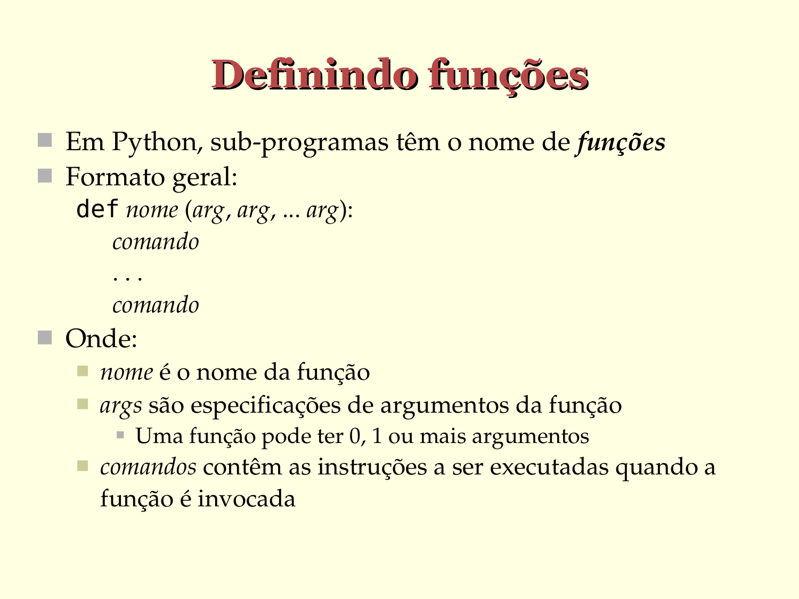

# Definindo funções

- Em Python, sub­programas têm o nome de funções
- Formato geral:
  
  ```python
  def nome (param_1, param_2, ... param_N):
      comando
      ...
      comando
   ```

- Onde:
   - `nome` é o identificador da função
   - `param_X` são especificações de parâmetros da função
      - Uma função pode ter 0, 1 ou mais parâmetros
   - `comandos` contêm as instruções a serem executadas quando a função for invocada




