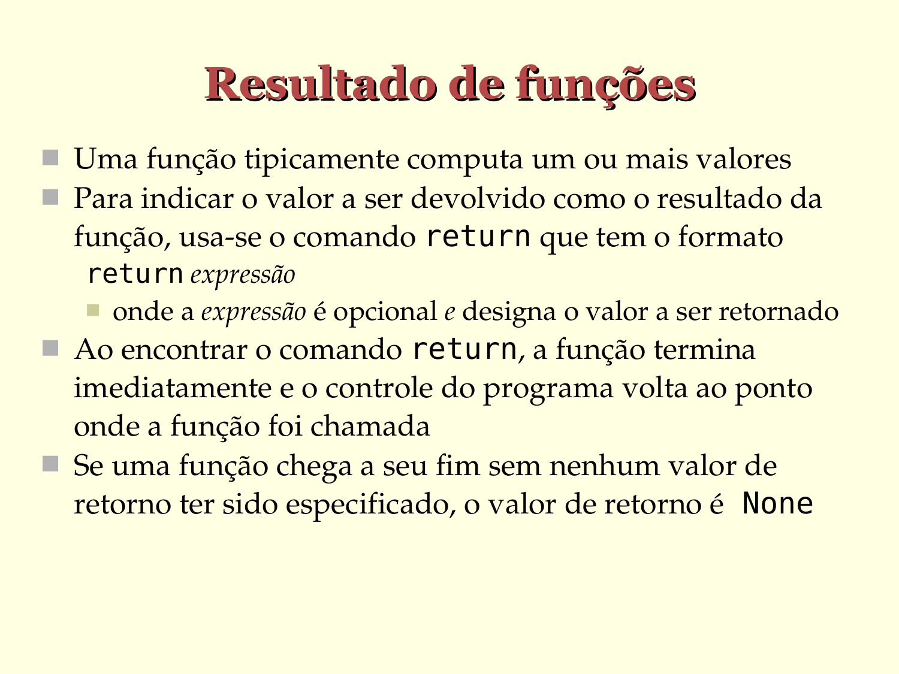

# Resultado de funções

- Uma função tipicamente computa um ou mais valores

- Para indicar o valor a ser devolvido como o resultado da função, usa-­se o comando `return` que tem o formato `return expressão`
   - onde a `expressão` é opcional e designa o valor a ser devolvido

- Ao encontrar o comando `return`, a função termina imediatamente e o controle do programa volta ao ponto onde a função foi chamada

- Se uma função chega a seu fim sem nenhum valor de retorno ter sido especificado, o valor de retorno é `NoneType`

