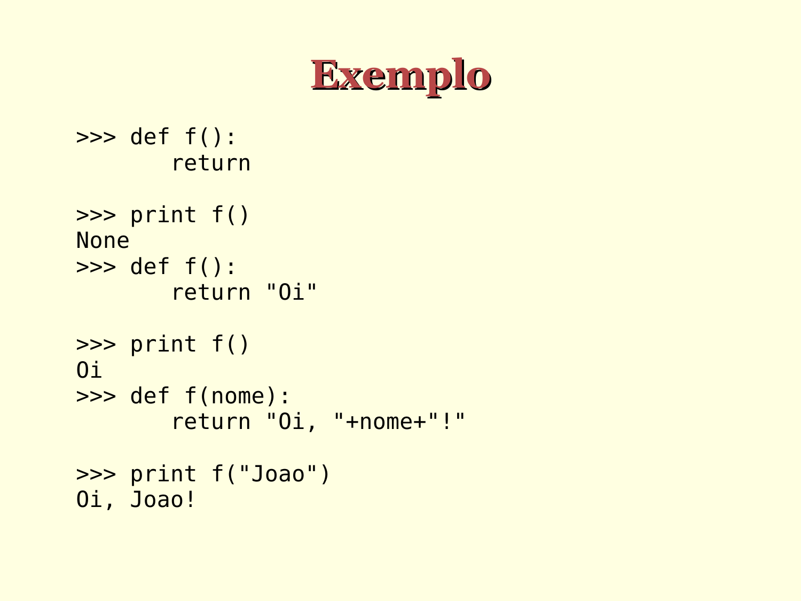

# Exemplos de funções

```python
>>> def f():
       return

>>> print(f())
NoneType

>>> def f():
       return "Oi"

>>> print(f())
Oi

>>> def f(nome):
       return "Oi, "+nome+"!"

>>> print(f("João"))
Oi, Joao!
```




