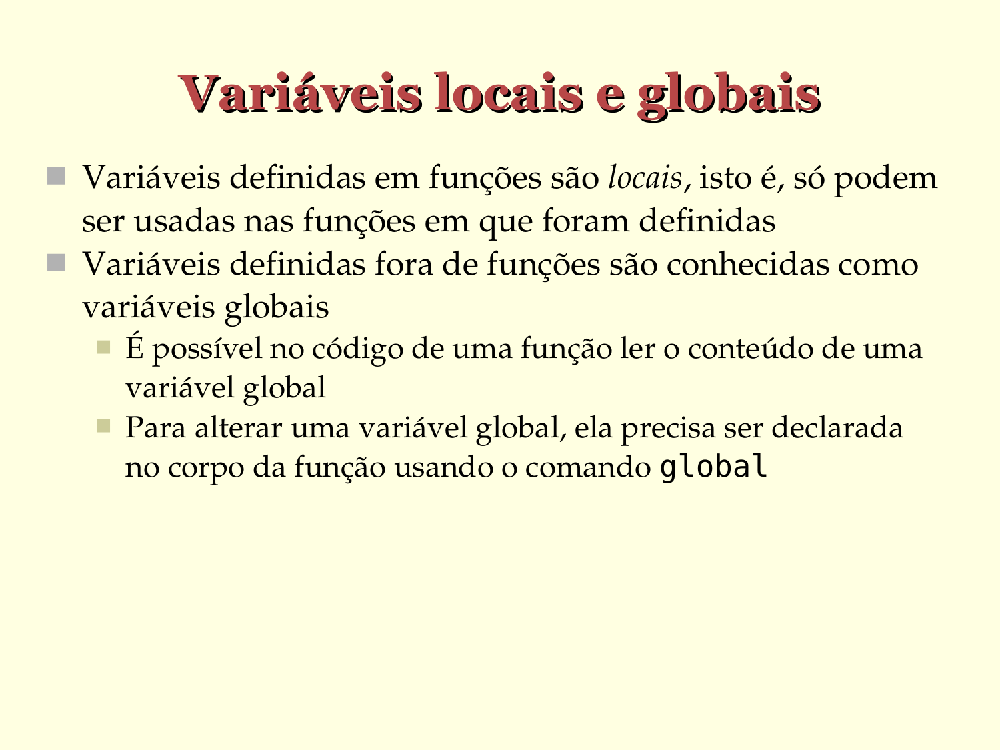

# Variáveis locais e globais

- Variáveis definidas em funções são locais, isto é, só podem ser usadas nas funções em que foram definidas
- Variáveis definidas fora de funções são conhecidas como variáveis globais
   - É possível no código de uma função ler o conteúdo de uma variável global
   - Para alterar uma variável global, ela precisa ser declarada no corpo da função usando o comando `global`

         

