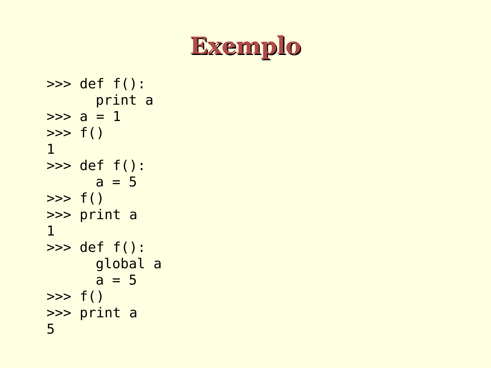

# Exemplos de escopo de variáveis

```python
>>> def f():
      print(a)

>>> a = 1

>>> f()
1

>>> def f():
      a = 5

>>> f()

>>> print(a)
1

>>> def f():
      global a
      a = 5

>>> f()

>>> print(a)
5
```




