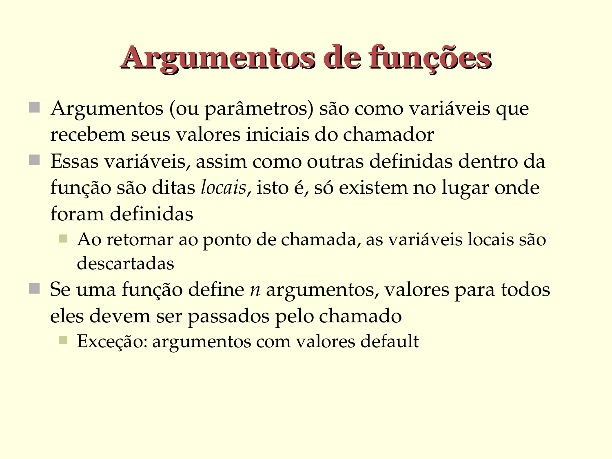

# Parâmetros de funções

- Parâmetros são como variáveis que recebem seus valores iniciais do chamador
- Essas variáveis, assim como outras definidas dentro da função são ditas locais, isto é, só existem no lugar onde foram definidas

  - Ao retornar ao ponto de chamada, as variáveis locais são descartadas

- Se uma função define *n* parâmetros, valores para todos eles devem ser passados pelo chamador

   - Exceção: argumentos com valores padrão

