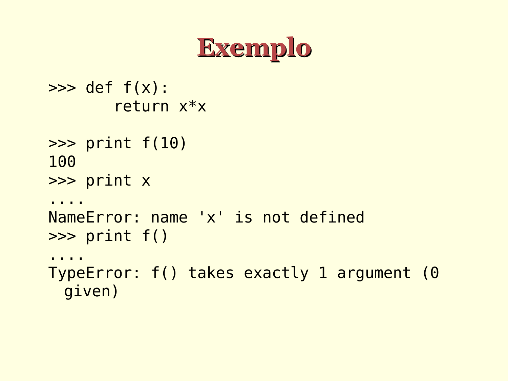

#  Exemplos de parâmetros/argumentos

```python
>>> def f(x):
       return x*x

>>> print(f(10))
100

>>> print(x)
[...]
NameError: name 'x' is not defined

>>> print(f())
[...]
TypeError: f() missing 1 required positional argument: 'x'
```




