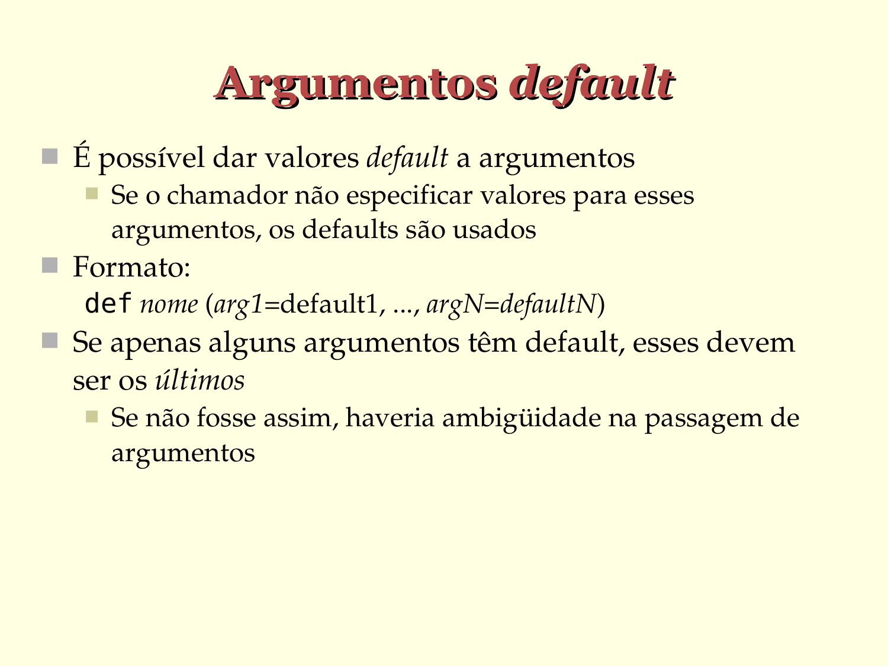

# Argumentos padrão

- É possível dar argumento padrão a parâmetros
   - Se o chamador não especificar valores para esses argumentos, os defaults serã usados

- Formato:

  ```python
  def id_funcao (
                 param_1=arg_padrao_1, 
                 param_2=arg_padrao_2, 
                 ..., 
                 param_N=arg_padrao_N
                 ):
      # Corpo da função
  ```        

- Se apenas alguns parâmetros têm argumentos padrão, esses devem ser os últimos

   - Se não fosse assim, haveria ambigüidade na passagem de argumentos




