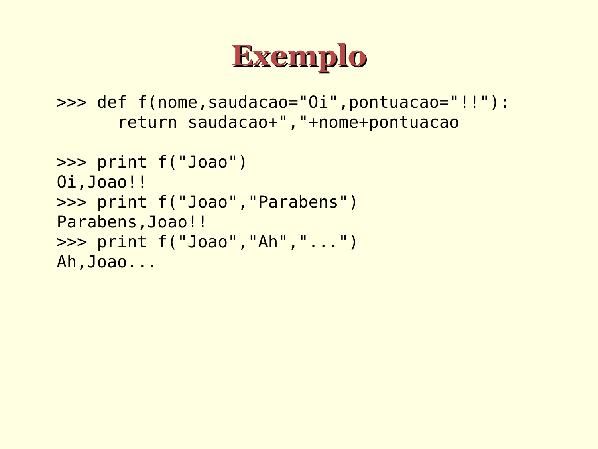

# Exemplos de argumento padrão

```python
>>> def f(nome, saudacao="Oi", pontuacao="!!"):
      return saudacao+","+nome+pontuacao

>>> print(f("João"))
Oi,João!!

>>> print(f("João","Parabéns"))
Parabens,João!!

>>> print f("João","Ah","...")
Ah,João...
```




