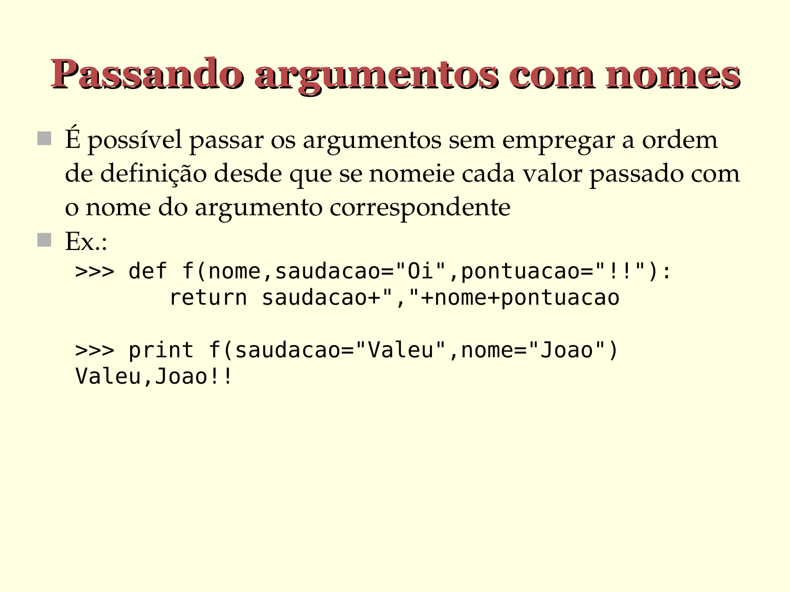

# Passando argumentos com nomes

- É possível passar os argumentos sem empregar a ordem de definição desde que se nomeie cada valor passado com o nome do argumento correspondente

- Ex.:

  ```python
   >>> def f(nome,saudacao="Oi", pontuacao="!!"):
          return saudacao+","+nome+pontuacao

   >>> print(f(saudacao="Valeu", nome="João"))
   Valeu,João!!
   ```




