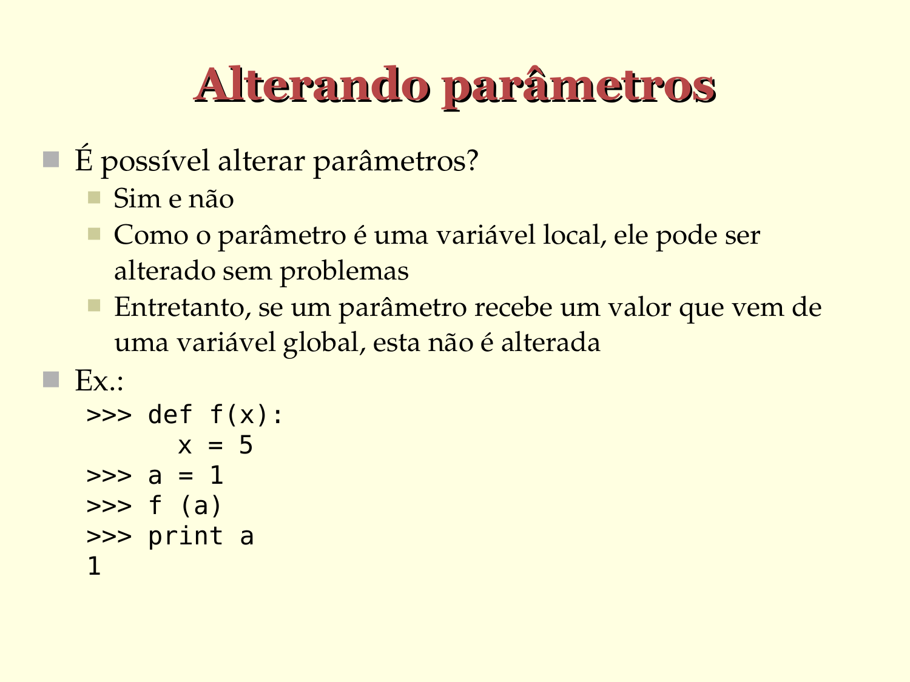

# Alterando parâmetros

- É possível alterar parâmetros?
   - Sim e não
   - Como o parâmetro é uma variável local, ele pode ser alterado sem problemas
   - Entretanto, se um parâmetro recebe um valor que vem de uma variável global, esta não é alterada

- Ex.:
  
  ```python
  >>> def f(x):
        x = 5

  >>> a = 1

  >>> f (a)

  >>> print(a)
  1
  ```


