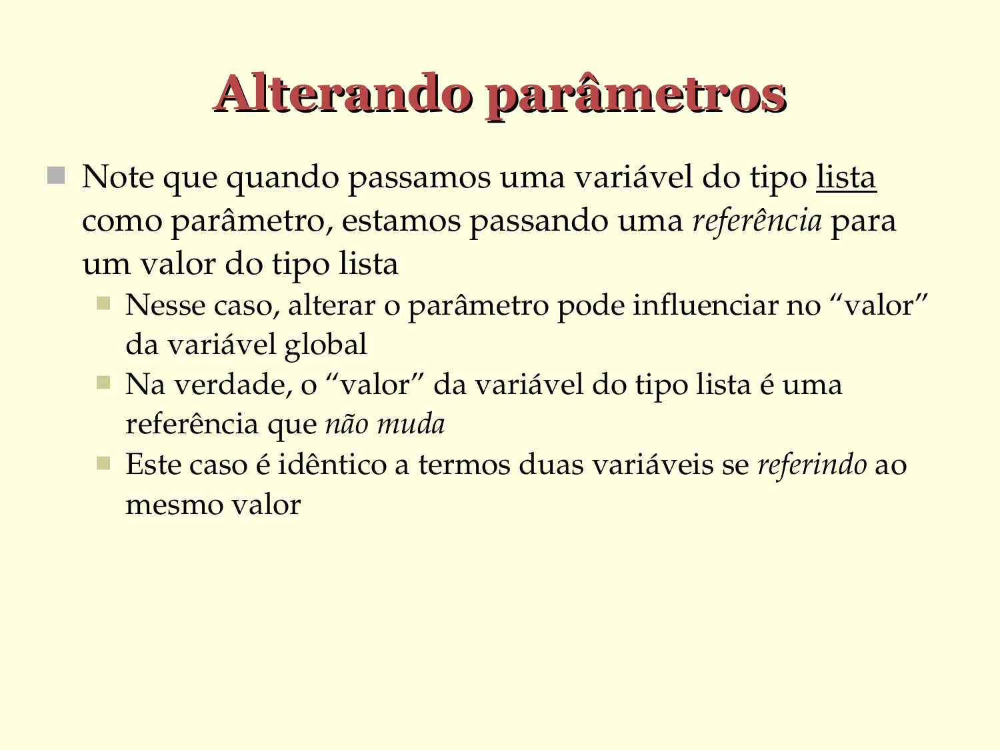

# Alterando parâmetros

- Note que quando passamos uma variável do tipo lista
  como parâmetro, estamos passando uma referência para
  um valor do tipo lista

   - Nesse caso, alterar o parâmetro pode influenciar no "valor" da variável global
   - Na verdade, o "valor" da variável do tipo lista é uma referência que não muda
   - Este caso é idêntico a termos duas variáveis se referindo ao mesmo valor

