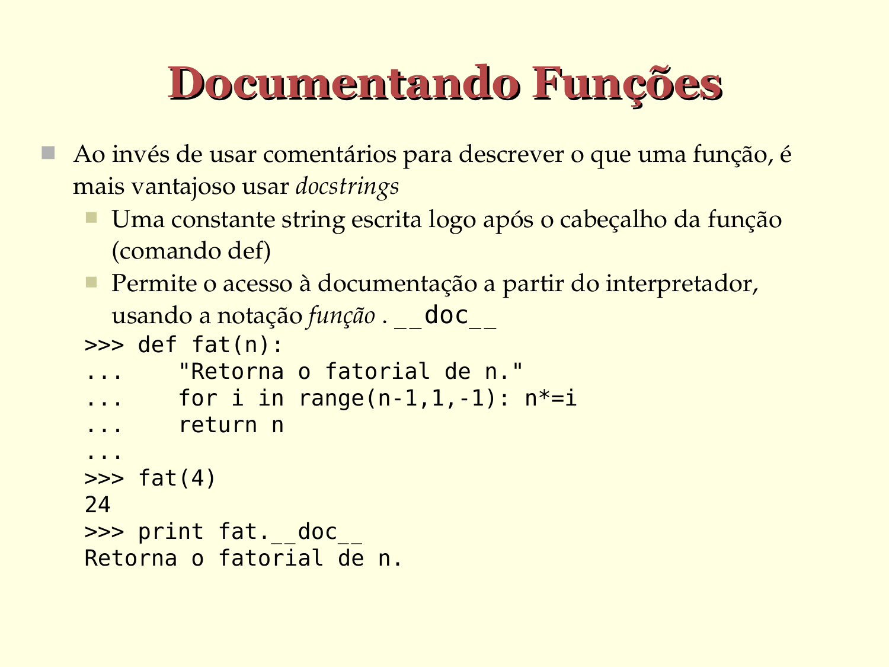

# Documentando Funções

- Ao invés de usar comentários para descrever o que uma função, é mais vantajoso usar *docstrings*

   - Uma constante string escrita logo após o cabeçalho da função (comando `def`)
   - Permite o acesso à documentação a partir do interpretador, usando a notação função `__doc__`

  ```python
  >>> def fat(n):
  ...    "Retorna o fatorial de n."
  ...    for i in range(n-1, 1, -1):
  ...        n*=i
  ...
  ...    return n
  ...

  >>> fat(4)
  24
  
  >>> print(fat.__doc__)
  Retorna o fatorial de n.
  ```



