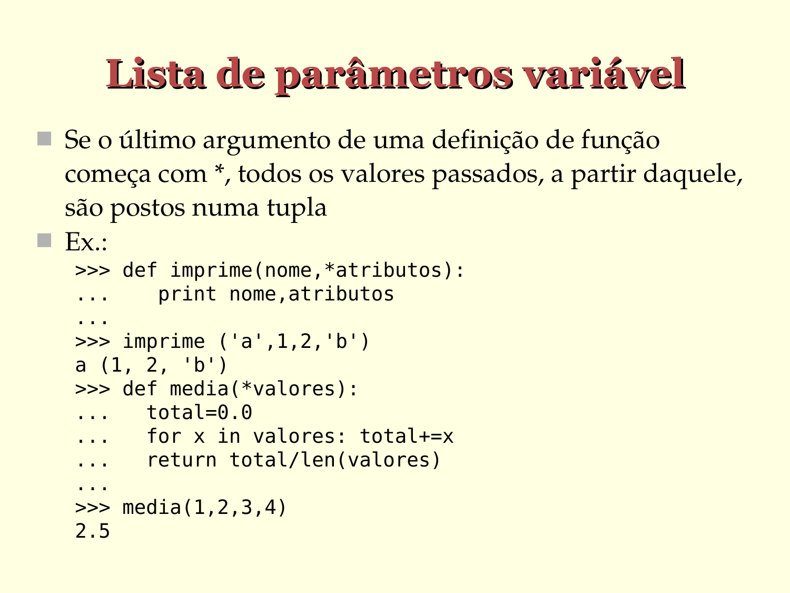

# Lista de parâmetros variável

- Se o último argumento de uma definição de função
  começa com `*`, todos os valores passados, a partir daquele, são postos numa tupla

- Ex.:

  ```python
  >>> def imprime(nome, *atributos):
  ...    print(nome,atributos)
  ...
  ...

  >>> imprime ('a',1,2,'b')
  a (1, 2, 'b')

  >>> def media(*valores):
  ...   total=0.0
  ...   for x in valores: 
            total+=x
            
  ...   return total/len(valores)
  ...

  >>> media(1,2,3,4)
  2.5
  ```




