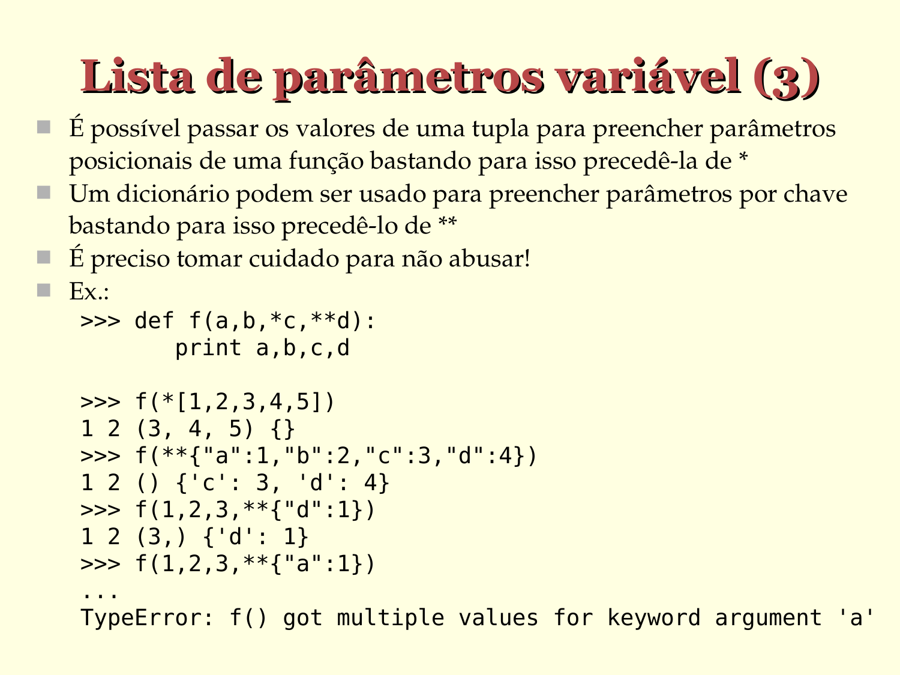

# Lista de parâmetros variável (3)

- É possível passar os valores de uma tupla para preencher parâmetros posicionais de uma função bastando para isso precedê­-la de `*`
- Um dicionário podem ser usado para preencher parâmetros por chave bastando para isso precedê­-lo de `**`
- É preciso tomar cuidado para não abusar!
- Ex.:
  ```python
  >>> def f(a,b,*c,**d):
         print a,b,c,d

  >>> f(*[1,2,3,4,5])
  1 2 (3, 4, 5) {}

  >>> f(**{"a":1,"b":2,"c":3,"d":4})
  1 2 () {'c': 3, 'd': 4}

  >>> f(1,2,3,**{"d":1})
  1 2 (3,) {'d': 1}

  >>> f(1,2,3,**{"a":1})
  ...
  TypeError: f() got multiple values for keyword argument 'a'
  ```




