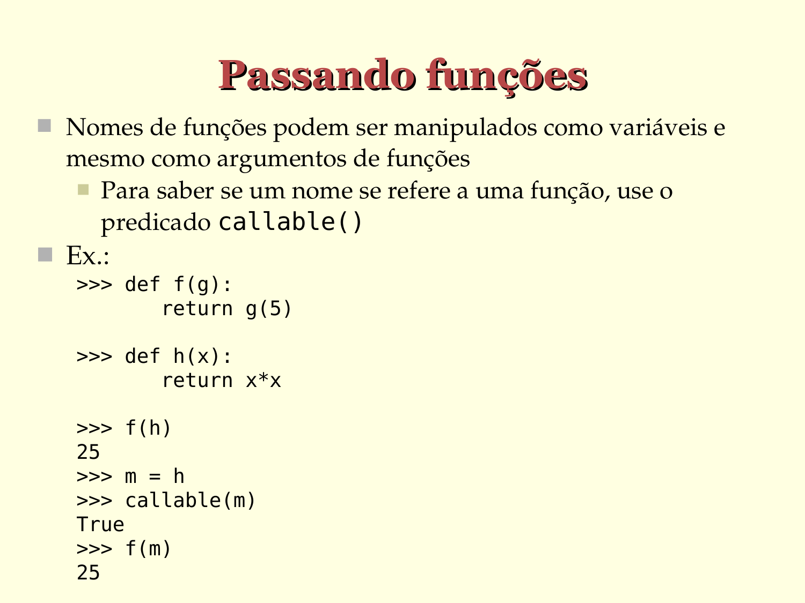

# Passando funções

- Nomes de funções podem ser manipulados como variáveis e mesmo como argumentos de funções
  - Para saber se um nome se refere a uma função, use o
    predicado `callable()`

- Ex.:
  
  ```python
  >>> def f(g):
         return g(5)

  >>> def h(x):
         return x*x

  >>> f(h)
  25

  >>> m = h
  >>> callable(m)
  True

  >>> f(m)
  25
  ```





