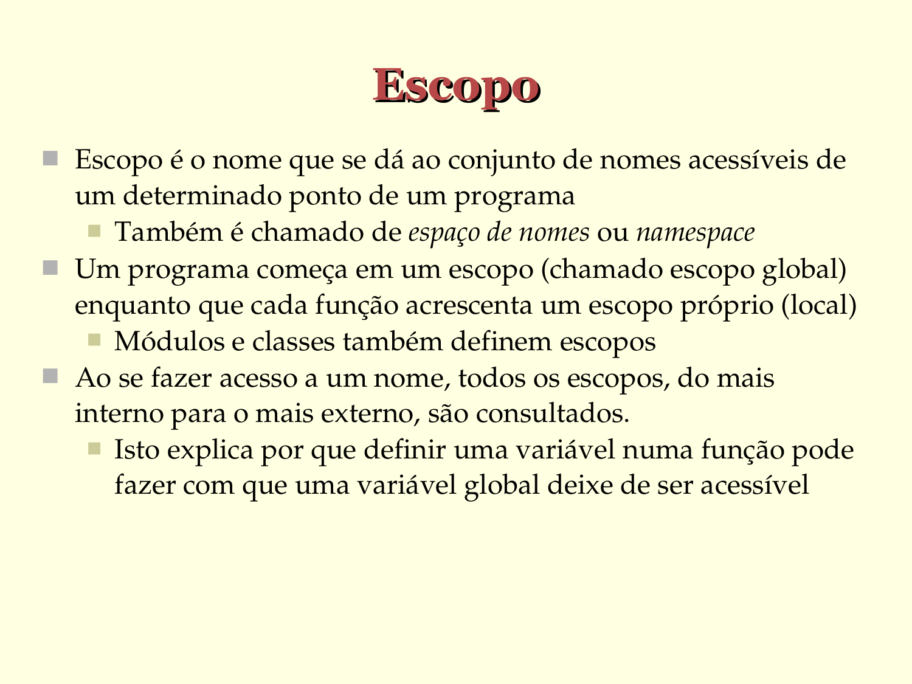

# Escopo

- Escopo é o nome que se dá ao conjunto de nomes acessíveis de um determinado ponto de um programa
   - Também é chamado de espaço de nomes ou namespace
- Um programa começa em um escopo (chamado escopo global) enquanto que cada função acrescenta um escopo próprio (local)
   - Módulos e classes também definem escopos
- Ao se fazer acesso a um nome, todos os escopos, do mais   interno para o mais externo, são consultados.
   - Isto explica por que definir uma variável numa função pode fazer com que uma variável global deixe de ser acessível

