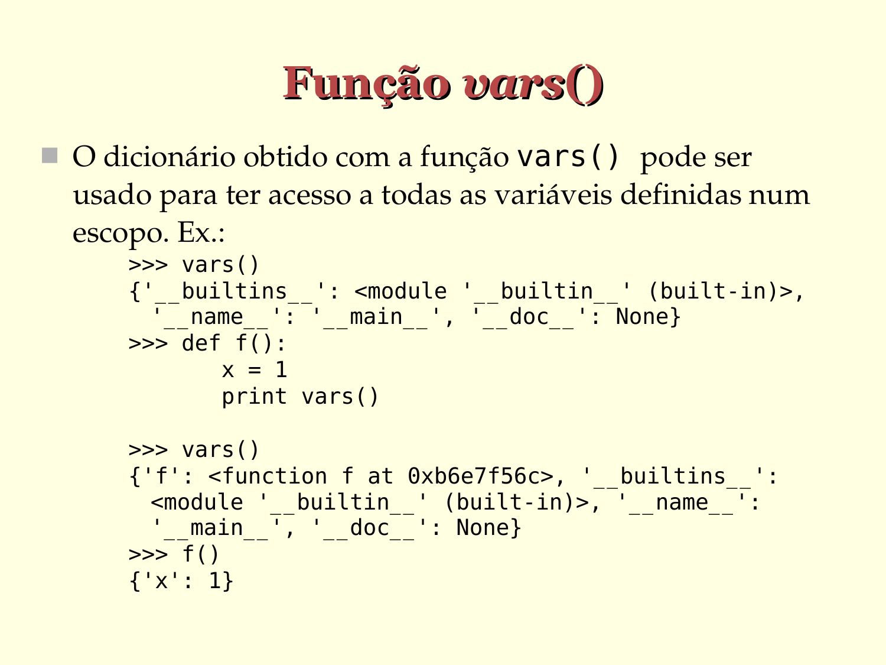

# Função vars()

- O dicionário obtido com a função vars() pode ser
  usado para ter acesso a todas as variáveis definidas num escopo. Ex.:

  ```python  
  >>> vars()
  {'__builtins__': <module '__builtin__' (built-in)>,
        '__name__': '__main__', '__doc__': None}
  
  >>> def f():
           x = 1
           print vars()

  >>> vars()
  {'f': <function f at 0xb6e7f56c>, '__builtins__':
      <module '__builtin__' (built-in)>, '__name__':
      '__main__', '__doc__': None}
  
  >>> f()
  {'x': 1}
  ```


