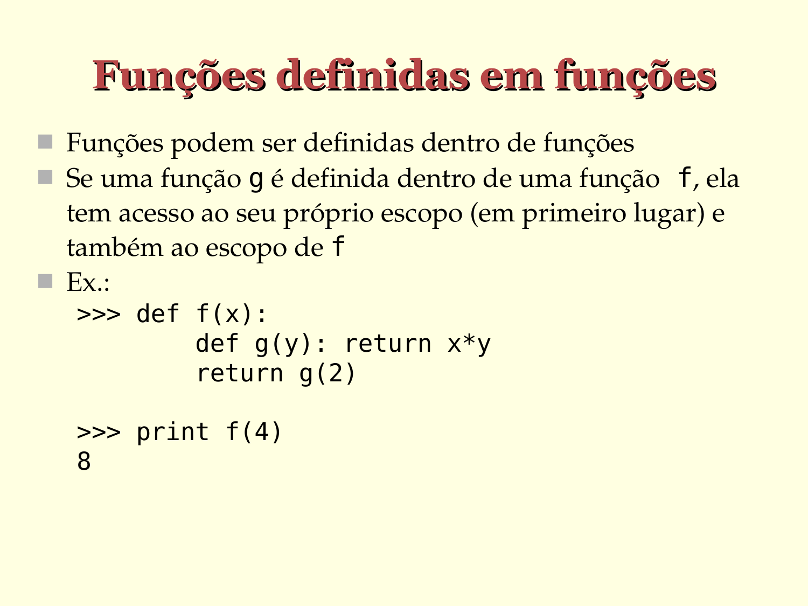

# Funções definidas em funções

- Funções podem ser definidas dentro de funções
- Se uma função g é definida dentro de uma função *f*, ela tem acesso ao seu próprio escopo (em primeiro lugar) e também ao escopo de *f*

- Ex.:

  ```python
  >>> def f(x):
         def g(y): return x*y
           return g(2)

  >>> print f(4)
  8
  ```





