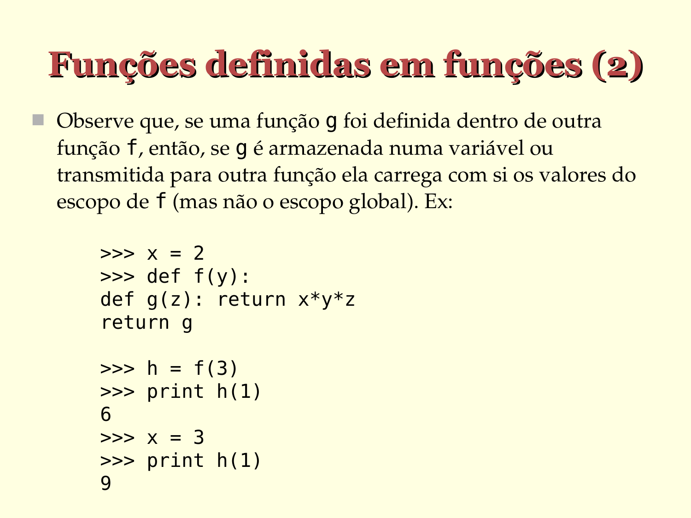

# Funções definidas em funções (2)

- Observe que, se uma função g foi definida dentro de outra
  função f, então, se g é armazenada numa variável ou
  transmitida para outra função ela carrega com si os valores do
  escopo de f (mas não o escopo global). Ex:

  ```python
  >>> x = 2

  >>> def f(y):
       def g(z): return x*y*z
       return g

  >>> h = f(3)

  >>> print h(1)
  6

  >>> x = 3

  >>> print h(1)
  9
  ```




